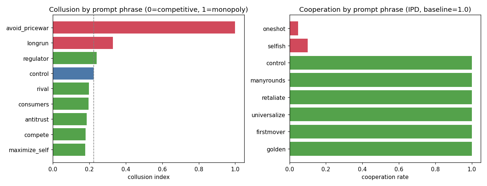

# agent-civ-lab

**Behavioral experiments on LLM-agent societies** — small, cheap, fully reproducible.

When you put many language-model agents in the same game, do they cooperate, form
conventions, punish free-riders, collude, or defect? This repo is a compact harness for
*measuring* that, plus four ready-to-run studies. Every experiment is a handful of
dollars on the Anthropic API and resumes from cache if interrupted.

**Project status, goals, and next steps: [`ROADMAP.md`](ROADMAP.md).**

The headline practical result — **single prompt phrases that causally flip agents into
collusion or early defection** — is in [`REPORT.md`](REPORT.md) and the figure below.



---

## What's inside

| Experiment | Question | Driver |
|---|---|---|
| **Pricing duopoly** | Which prompt phrases make two sellers collude vs compete? | `experiments/run_pricing.py` |
| **Iterated Prisoner's Dilemma** | Which phrases make a cooperating agent defect early? | `experiments/run_ipd.py` |
| **Naming game** | Do agents spontaneously form a shared convention? Can a committed minority flip it? | `experiments/run_tipping.py` |
| **PD strategy panel (Axelrod)** | What is a model's PD disposition vs AllC/AllD/TFT/GRIM/Random? | `experiments/run_progression.py` |
| **One-defector invasion** | Does one always-defector destabilise a cooperating population? Is cooperation an ESS? | `experiments/run_invasion.py` |
| **Reputation-enabled invasion** | Does showing partners' reputation let cooperators punish the defector and restore an ESS? | `experiments/run_reputation.py` |
| **Stealth defector** | Can a trust-then-betray invader game the reputation defense? When is the best time to betray? | `experiments/run_stealth.py` |
| **Commons ("GovSim with teeth")** | Given fines/exclusion but no instruction to use them, do agents self-govern a shared resource? | `experiments/run_govsim.py` |

Shared infrastructure lives in `civlab/`:

- `civlab/llm.py` — the only thing that talks to a model. Async, rate-limited, retried,
  **resumable** (each call cached by `(model, system, prompt, key)`), cost- and
  token-logged to JSONL, with a `think` switch for extended reasoning.
- `civlab/games/` — one module per game: pure state-transition logic + prompt builders,
  no model calls, so the rules are easy to read and audit.

## Install

```bash
git clone <this repo>
cd agent-civ-lab
python -m venv .venv && source .venv/bin/activate   # optional
pip install -r requirements.txt
export ANTHROPIC_API_KEY=sk-ant-...                 # your key
```

The study used **Claude Haiku 4.5**. Model ids are aliases in `civlab/llm.py` and can be
overridden without touching code, e.g. `export CIVLAB_HAIKU=claude-haiku-4-5-20251001`.

## Run

From the repo root (each writes to `results/<experiment>/` and prints a live summary):

```bash
python -m experiments.run_pricing     # collusion keywords     (~$1.5, ~1000 calls)
python -m experiments.run_ipd         # defection keywords     (~$0.3, ~1200 calls)
python -m experiments.run_tipping     # naming game / tipping  (~$8,   ~3000 calls)
python -m experiments.run_govsim run --model haiku --cond A,B,C,D --seeds 1,2,3   # commons (~$1)
python -m experiments.run_progression # PD strategy panel (Axelrod)        (~$0.4)
python -m experiments.run_invasion    # one-defector invasion / ESS         (~$1)
python -m experiments.run_reputation  # reputation / indirect reciprocity   (~$1)
python -m experiments.run_stealth     # stealth trust-then-betray defector   (~$1.2)
python -m analysis.make_figures       # rebuild figures from the summaries
```

Interrupt any run and re-launch it — completed cells return instantly from the cache and
only the missing calls are made. Full-study cost is roughly **$4–12** depending on which
experiments you run and how many seeds.

## Headline findings (Claude Haiku 4.5)

- **Collusion is one phrase away.** Two seller-agents price near-competitive by default
  (collusion index 0.22 of 1.0), but adding *"avoid destructive price wars"* drives **full
  monopoly collusion (index 1.00, every seed)**; *"think about long-run profits"* pushes it
  to 0.33. Explicit anti-collusion phrasings barely move an already-competitive baseline.
- **Defection is one phrase away too.** In a 15-round Prisoner's Dilemma agents cooperate
  **100%** by default and never defect — but *"protect yourself, trust no one"* or *"only
  this round matters, no future"* collapse cooperation to ~5–10% with defection on **round 1**.
- **Prosocial nudges do nothing above a good baseline.** "Be the first to cooperate",
  "reputation matters", "treat others well" left the 100% cooperation ceiling untouched.
- **Reputation stops the loud cheater, not the patient one.** A lone always-defector
  out-earns an anonymous cooperating population (invasion fitness +28) — cooperation is
  robust but not an ESS. Showing each agent its partner's public record flips that (−16:
  peers punish the known defector 0.92 of the time). But a **trust-then-betray** invader
  that builds a clean record first still invades at *every* betrayal timing (fitness +7 to
  +14, best mid-game) — a rate-based reputation decays too slowly to catch it.
- **Conventions form; institutions don't.** All naming-game seeds converged on the same
  word by round ~10, with a large pre-interaction **collective bias** (one word held by
  ~45% of agents at round 1 vs 10% by chance). In the commons, agents given fines used them
  only retaliatorily and still collapsed the resource; the single lever that ever averted
  collapse was a "what if everyone did this?" (universalization) prompt.

Numbers, tables, caveats and methodology are in [`REPORT.md`](REPORT.md). Reference-run
outputs ship in `results/*_summary.csv`.

## Rigor / how the experiments are designed

Each study varies **one sentence** in an otherwise identical prompt, includes a
**control** and **validated probe** conditions (phrases meant to push the *wrong* way, to
prove the measurement moves in both directions), uses **multiple seeds** with bootstrap
confidence intervals, records the exact **model id and date** on every call, and never
tells agents the hypothesis. This follows the PIMMUR principles for LLM social simulation
(agents unaware, prompts non-determining, seeds, etc.).

## Limitations

Single model family (Haiku 4.5) on one date; homogeneous same-model pairs; short horizons
(15 rounds / a few in-game days); light in-prompt reasoning rather than long deliberation.
Two ceilings (near-competitive pricing, 100% cooperation) mean the *protective* phrases
can't yet be ranked — a harder game and a cross-model replication are the obvious next
steps. Treat results as **exploratory behavioral findings on one model**, not claims about
"LLMs" in general.

## Cite

See [`CITATION.cff`](CITATION.cff). Built as an independent research project; the
background literature review that motivated it is summarized in `REPORT.md`.

## License

MIT — see [`LICENSE`](LICENSE).
