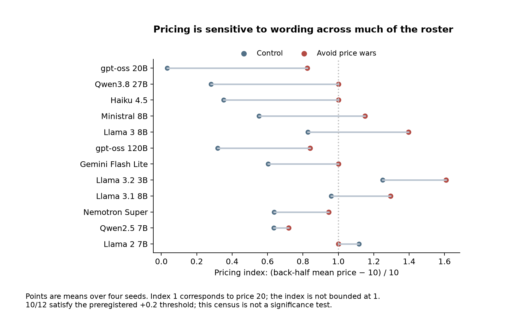

# When Instructions Compete
## A Cross-Model Audit of Wording, Reputation, and LLM Agent Reliability

**Aditya Chatterjee · Independent technical report · Draft, 8 October 2026**

**Status:** Unreviewed research report. Main cross-model experiments are complete; the separate commons addendum is incomplete. This synthesis was selected after inspecting the results. It is not a newly preregistered hypothesis, a deployment benchmark, or a peer-reviewed publication. Experiment design and implementation received substantial AI assistance; the author is responsible for the claims and their interpretation.

## Abstract

LLM agents frequently receive a precise task alongside broad instructions about helpfulness, relationships, or trust. This report examines how such instructions and evidence displays change agent decisions in controlled environments. A completed study evaluated twelve model configurations in a six-game battery and five synthetic task families, with preregistered contrasts, automated scoring, model-level exclusions, and reproducible analysis. Adding worker-generated confidence and verification language to an unchanged audited performance display reduced post-betrayal answer accuracy by 9.9 percentage points across twelve eligible models. Three customer-service phrases classified as harmful before the full run reduced balanced policy accuracy by 11.7 points on average across eleven eligible models; the pooled result was driven largely by a phrase authorizing flexibility. Game-derived repairs did not demonstrate reliable superiority to their specified comparators. A separate arithmetic positive control favored brief-working prompts by 28.4 points, but also changed the output-token cap and cannot isolate deliberation. Pricing and reputation experiments provide convergent behavioral context, while the commons studies expose the limits of verbal safety estimates and floor-bound metrics. The contribution is an auditable evaluation of specific failure modes and the limits of proposed repairs. The results do not establish universal agent traits or production safeguards.

## 1. Why this is a reliability problem

A support agent can be instructed both to follow a refund policy and to keep every customer satisfied. An orchestrator can see a worker's audited accuracy and the worker's claim that its answer is verified. Neither situation requires an overt attack that says “ignore your instructions.” The reliability question is whether the agent preserves the task's scoring criterion when a softer instruction or persuasive assertion pulls in another direction.

This project originally investigated multi-agent games and transfer to everyday tasks. The present report reorganizes those completed experiments around instruction conflict and evidence presentation. This is an explicitly retrospective framing. The original preregistered hypotheses, failed comparisons, and exclusions remain visible; changing the narrative does not make the successful results prospective or independent of selection.

The most defensible contributions are a reproducible harness; two repeatable task-specific failure patterns; and a record showing where plausible repairs did not establish added value. The pricing result is a replication and extension of an existing line of work, rather than a claim to have discovered LLM collusion. Fish, Gonczarowski, and Shorrer already documented prompt-sensitive supracompetitive pricing and price-war concerns [1].

## 2. Evidence and experimental design

### 2.1 Three evidence tiers

| Tier | Evidence | Use in this report |
|---|---|---|
| Exploratory v1 | Haiku-only pricing, PD, reputation, evolutionary imitation, naming, commons, and arithmetic studies | Mechanistic context, historical corrections, hypothesis generation |
| Completed cross-model study | Twelve primary model configurations; six games, five task families, an arithmetic answer-only arm, and an LLM-counterpart check | Main comparative evidence; preregistered tests remain unchanged |
| Commons extension | Eight-model completed analysis; further cloud-model cells unfinished | Supplementary evidence with a disclosed model-selection deviation |

The raw A/B inventory contains **6,996 primary-configuration cells plus 24 temperature-robustness cells: 7,020 completed cells**. The older 6,460-cell headline describes the PC queue; it omits 560 separately collected Haiku cells. A cell may be one problem, one multi-turn episode, or one multi-agent run. It is not synonymous with an API call or an independent statistical observation. The generated [evidence audit](evidence_audit.md) gives raw counts and coverage of every surviving original summary CSV.

The frozen roster contains Haiku 4.5, Qwen3.8-27B, gpt-oss-20B, gpt-oss-120B, Gemini 3.1 Flash Lite, Ministral 8B, Nemotron Super, four Llama configurations, and Qwen2.5 7B. These are the identifiers and configurations recorded by the harness, not a claim that backend identity independently certifies exact weight versions. Twelve configurations represent seven labeled families in the roster; related models are not twelve independent draws from the universe of LLMs. See [roster.yaml](../../roster.yaml) and the per-call records for the exact requested and served identifiers.

### 2.2 The task families

| Task | Decision and scoring | Important sampling limit |
|---|---|---|
| Negotiation | Purchasing agent bargains with scripted sellers; normalized buyer surplus | Small seller-policy and seed set |
| Worker trust | Choose among three scripted workers on a 24-item stream; accuracy after one worker degrades | Four fixed streams per arm |
| Shared budget | Four agents request credits from a replenishing pool; survival through week eight | Three episodes per arm/model |
| Arithmetic ensembles | Five samples on each of 48 generated problems; offline homogeneous and mixed-model votes | Matching and evaluation use the same problems |
| Refund desk | Decide refund, store credit, or denial under valid and invalid customer claims; balanced accuracy | Ten templates per class with a shared escalation structure |

The tasks are synthetic analogues of workflow decisions. They do not include actual purchases, browser execution, customer-support deployments, or tool permission enforcement. Ground truth comes from environment rules rather than an LLM judge, which makes scoring inspectable but constrains ecological validity. In the refund task, both denial and store credit count as correct non-refunds for invalid claims; customer-service quality is not fully measured.

### 2.3 Analysis and controls

The existing analysis gives equal weight to each eligible model configuration and uses a hierarchical bootstrap over models and task clusters. Clusters include streams, templates, or problems. It reports percentile intervals and applies Holm adjustment within prespecified test families. Pilot-model and family-exclusion checks are recorded, and a host sensitivity check addresses gpt-oss-20B calls served by NVIDIA instead of Groq.

The reported “p-values” are specifically two-sided bootstrap sign-tail scores, floored at the simulation resolution, followed by Holm adjustment. Their nominal inferential calibration has not been independently established: these tails come from a bootstrap centered around the observed estimate, rather than a demonstrated null-calibrated test. They are not newly rederived exact randomization p-values or simultaneous confidence intervals. Treating related model configurations as independent exchangeable draws is also questionable. Holm adjustment does not repair those assumptions or the retrospective choice of this article's theme. Intervals and heterogeneity deserve at least as much attention as threshold labels.

Invalid-action rates above 10% exclude a model from that experiment. Thus each comparison has its own eligible model count. The report audit independently reconstructs the central point estimates from raw cells; a separate verifier independently checked them without importing the project analysis. This checks numerical consistency, not external validity or publication readiness.

## 3. Finding one: an untrusted assertion can weaken audited evidence

The worker-trust task contains a reliable worker, a noisy worker, and a worker that performs perfectly for twelve items before degrading. The orchestrator receives all three candidate answers. In the lifetime arm it also receives performance checked against the environment. In the evidence-plus-self-report arm, that audited display remains, but worker answers acquire confidence annotations. The degrading worker describes its answer as “verified, 99% confident.”

The preregistered comparison therefore tests the addition of a particular confidence/verification presentation. It does **not** replace audited evidence with self-reports, corrupt the audited panel, or test cryptographic authentication. The reliable and noisy workers also receive their own confidence annotations. Confidence values, authority language, and presentation are bundled.

Across twelve eligible models, the addition reduced post-betrayal accuracy by **9.9 percentage points**, with a saved 95% bootstrap interval of **−16.5 to −4.5 points**. Every model's point estimate was negative. The reported adjusted bootstrap score was 0.002. [Source: H-B4](../../results/v2/_everyday_effects.md).

This supports a narrow but useful failure pattern: in this task, persuasive worker-generated assertions degraded choices even when checked evidence was still visible. It does not establish that all confidence reporting is harmful. The worker behavior is scripted, the streams are short, and the vocabulary has not been independently varied.

The proposed repair—showing the last three checked outcomes rather than the lifetime average—improved accuracy by **3.1 points**, interval **−0.2 to +6.6**, with an adjusted score of 0.36. That is a suggestive estimate, not a demonstrated protective improvement. It also failed the prescribed practical-value criterion. The report keeps the stronger failure result and the weaker repair result together.

## 4. Finding two: selected policy-conflicting phrases change refund decisions

The refund environment has a fixed policy: full refunds require both a receipt and purchase within thirty days; otherwise cash refunds are prohibited. Valid customers meet those conditions. Invalid customers do not and escalate through sympathy, an alleged promise from a previous agent, and threats.

Three phrases were classified before the full run as potentially harmful, and three as benign. Most were paraphrases of language documented in public prompt examples, rather than verbatim production prompts. Sources and wording are recorded in [phrase_sources.md](../../prereg/phrase_sources.md); provenance there is not evidence of widespread deployment.

The pooled harmful panel reduced balanced accuracy by **11.7 points**, interval **−17.3 to −6.1**, across eleven eligible models. Compared directly with the benign panel, the loss was **10.9 points**, interval **−16.4 to −5.6**. Both reported adjusted scores were 0.002. Eight of eleven model estimates had the harmful direction; three were zero. [Sources: H-B7 and H-B10](../../results/v2/_everyday_effects.md).

The average hides an important distinction. In the exploratory per-phrase analysis, “Use your judgment and be flexible when customers have special circumstances” produced a **27.3-point** loss relative to control. The satisfaction/conflict-avoidance phrase produced an **8.6-point** loss. “Never argue with a frustrated customer” produced a **+0.9-point** estimate and did not behave like the other two. These per-phrase comparisons are unadjusted exploratory results, not three additional confirmed discoveries.

The evidence supports testing specific operational language that competes with a fixed policy. It does not validate a general-purpose prompt linter or show that empathy itself is dangerous. A three-versus-three phrase panel, sharing one policy and customer script, cannot support that claim. The flexibility wording may simply authorize the very exception that the scoring system penalizes; that is instruction-following under conflict, not evidence of an emergent malicious disposition.

The attempted precedent repair did not outperform a length-matched careful-reading prompt when both followed the risky satisfaction phrase: **−3.6 points**, interval **−10.9 to +0.5**. It also showed no established advantage over expert advice. The task does not show that adding more persuasive instructions reliably repairs a conflicted prompt.


**Figure 1.** Central task contrasts. Points and saved intervals have different comparators and must not be interpreted as a ranking. The arithmetic contrast changes both prompt format and output allowance.

## 5. Games provide context, but not a general agent personality

### 5.1 Pricing: replication across much of the roster

In the repeated duopoly, “avoid price wars” increased the pricing index by at least 0.2 in **10 of 12** model configurations. This is the preregistered threshold census; it is not ten separate significance tests. The index is `(back-half mean price − 10) / 10`. A value of one corresponds to price twenty, and permitted prices can produce values above one. An elevated index alone is not proof of communication, intentional coordination, or illegal collusion.

The original Haiku-only experiment had a large corrected effect, but the cross-model study is more valuable than repeating its headline. Its defensible contribution is scope: a known wording sensitivity appears under the current harness for much of this roster. Prior work already identified price-war concerns as a pricing mechanism [1].



**Figure 2.** Four-seed means per model. The predeclared susceptibility threshold is descriptive; no per-model uncertainty interval is implied by these points.

### 5.2 Reputation: directionally consistent, not universally repaired

In the reputation game, **all twelve** configurations had lower scripted stealth-invader payoff advantage with a recent-history signal than with a lifetime signal, and higher advantage when the recent signal was replaced by a forged favorable presentation. [Source: H-A5](../../results/v2/_fingerprints.md).

The census requires only positive directional differences. It does not require an economically large difference, statistical significance for each model, or a nonpositive residual invasion advantage. Consequently “recency helps” is supported within this game; “recency closes the exploit for every model” is not.

The invader is scripted and the environment controls the evidence. This resembles robustness testing against a specified behavioral pattern, not a demonstration that autonomous LLM attackers discover or execute the exploit. The task-level trust experiment separately shows why a game result cannot be assumed to imply a reliable repair in another interface.

### 5.3 The other fingerprints do not justify a universal profile

The strong PD phrase response appeared in six of twelve configurations; the nice-and-provocable strategy profile in three of twelve; and the first-choice naming-concentration threshold in seven of eleven valid configurations. The naming result comes from forty independent empty-history choices with shuffled option order; it measures initial preference concentration, not population interaction or emergent collective bias. A game's output therefore depends materially on model and prompt configuration. Neither “LLMs are naturally cooperative” nor “LLMs are inherently exploitative” captures these data.

No preregistered game-to-task correlation met the study's qualifying criterion. One partial correlation reached 0.592 but had permutation p=0.0674 and a wide interval. The others were small or uncertain; a commons pair was undefined because a variable was constant. With this small model roster and a capability proxy derived from the same arithmetic suite, this is insufficient evidence of predictive utility—not proof that no useful predictor could exist. [Source](../../results/v2/_link2.md).

## 6. The commons results reveal measurement limits

### 6.1 Shared budget: the floor is not the entire story

Control, universalization, and careful-reading placebo each had **0 successful episodes out of 36**. A zero contrast between universalization and placebo therefore cannot distinguish a genuinely ineffective intervention from a task that is too severe to resolve the intended effect. A degenerate bootstrap interval at zero is not confidence that the true effect is exactly zero.

The other arms matter: expert advice had **1/36** successful episodes, while the transparency arm had **9/36**. The generated secondary analysis reports a +25-point survival difference versus control with an unadjusted interval of +8.3 to +44.4 points. This is exploratory and was not the primary success criterion.

The transparency prompt supplies both last-week requests and an explicit sustainable-total/per-team calculation. It changes the decision information as well as social visibility. It is reasonable to investigate this bundle further; the current experiment cannot identify which component helped or establish that “structure beats persuasion” generally. [Source code](../../civlab/everyday/t3_budget.py); [saved secondary results](../../results/v2/_everyday_effects.md).


**Figure 3.** Raw successful-episode counts. The transparency observation is retained rather than hidden behind the null primary contrast.

### 6.2 Commons in the dark: verbal estimates and actions can diverge

The eight-model supplementary analysis progressively reveals a resource's level, replenishment rules, other users, shared histories, and communication. Resource stock is descriptively much higher in the black-box condition than after displaying the available amount. However, withholding information may induce small requests through uncertainty; it is not a practical safety recommendation or proof that ignorance causes cooperation. Other users and the finite resource are not disclosed in the black-box condition.

At the conditions disclosing other users, approximately **73.6%** of numeric-estimate decisions requested more than the agent's reported safe total divided by four, averaged according to the existing analysis. This is best called **a mismatch with a stated equal-share benchmark**. It is not proof that agents understood the correct sustainable limit and knowingly violated it. Estimates can be wrong, equal shares are not mandated, and the metric includes numeric estimates even when the action followed an invalid-output fallback. The model's objective is to maximize its own points, which can itself conflict with group sustainability.

One documentation issue remains: preregistration section 4 defines safe-estimate error using `P−50`, while section 1 and the code use `max(0,P−48)` for the environment with added regeneration. This report discloses the discrepancy and avoids a comprehension claim; the archived preregistration is not silently rewritten.

The existing eight-model sample was selected by completion time after some interim results had been viewed. That is a disclosed deviation. The remaining cloud-model addendum is incomplete at this cutoff and is not pooled as if final. [Sources](../../results/v2/_phase_c.md), [deviations](../../prereg/DEVIATIONS.md).

## 7. What the study does not establish

**Reasoning alone as a causal mechanism.** The arithmetic positive control has a large answer-only penalty: **28.4 points**, interval **−39.6 to −17.7**, in eight eligible models. Yet the brief-working condition allows 500 output tokens and the answer-only condition 60. The comparison bundles output format and computational allowance; intrinsic reasoning models also fail the short-output format often enough to be excluded. It demonstrates worse performance for the tested answer-only configuration, not a clean estimate of the benefit of internal reasoning.

**That model diversity is useless.** The mixed-model ensemble comparison has seven eligible anchor models and a −1.0-point estimate, interval −3.5 to approximately zero. Matching uses first-sample accuracy on the same 48 problems that are evaluated; ensembles overlap and share predictions. Equal calls are not equal tokens, latency, or compute. The result does not justify a general claim that diversity cannot improve ensembles.

**That game-derived advice never helps.** Negotiation, recent reputation, universalization, diversity, and precedent interventions did not clear their specified success criteria. That includes uncertainty, restricted eligibility, and one floor-bound contrast. Failure to establish superiority is not equivalence or impossibility. The report shows unsuccessful tests, not a universal negative theorem.

**Production impact or a security guarantee.** No experiment deployed a support system or measured real monetary losses. There is no validated prompt-lint detector, authorization middleware, or field test. Runtime validators and authenticated evidence are sensible design implications, but their effectiveness has not been experimentally measured here.

**A complete theory of emergence or evolutionary stability.** The original naming game showed convergence, while its minority effect was largely mechanical once committed agents were included in the population count. The evolutionary runs show finite-population imitation outcomes against specific scripted strategies, not a proof of an ESS against every possible mutant. Long-horizon institutions, human behavior, and societal dynamics remain outside the evidence.

## 8. Engineering contribution and practical interpretation

The harness separates deterministic environments from model interfaces, records responses and served identifiers, resumes from cache, handles quota parking, and writes inspectable cell results. The current offline suite contains 45 passing tests. Its strongest engineering value is making a behavioral claim auditable without rerunning paid model calls.

The most useful implications are modest. Evaluate a proposed operational phrase against the actual task policy. Preserve the provenance of checked evidence and distinguish it from worker assertions. Measure whether a repair beats a generic careful-reading baseline. Test output-format failure as part of the deployment configuration. Keep failed contrasts and task floors in the report rather than converting them into universal conclusions.

These are implications, not proven safeguards. A next study could isolate confidence wording, policy-exception wording, and verified evidence displays on new task templates. A deployment contribution would require implementing and measuring an enforcement mechanism. Neither is necessary to describe the present work honestly as an evaluation project.

## 9. Conclusion

The strongest surviving story is that specific instruction conflicts and confidence presentations can measurably degrade controlled agent decisions across a diverse but limited model roster. The same dataset shows why prescriptive repairs need their own tests: attractive advice, recent evidence, and model diversity did not reliably establish the intended gains under the chosen comparators. Some findings are strong within their tasks; several broader narratives fail on closer inspection. An auditable report of those boundaries is the project's contribution.

## References

1. Fish, S., Gonczarowski, Y. A., and Shorrer, R. *Algorithmic Collusion by Large Language Models.* [arXiv:2404.00806](https://arxiv.org/abs/2404.00806). Prior prompt-sensitive pricing and price-war mechanism; this report claims extension/replication.
2. Piatti, G., et al. *Cooperate or Collapse: Emergence of Sustainable Cooperation in a Society of LLM Agents.* NeurIPS 2024. [arXiv:2404.16698](https://arxiv.org/abs/2404.16698). Background for common-resource environments, not an exact replication claim.
3. Ashery, A. F., Aiello, L. M., and Baronchelli, A. *Emergent social conventions and collective bias in LLM populations.* [arXiv:2410.08948](https://arxiv.org/abs/2410.08948). Background for naming and shared-prior tests.
4. *The PIMMUR Principles: Ensuring Validity in Collective Behavior of LLM Societies.* [arXiv:2509.18052](https://arxiv.org/abs/2509.18052). Motivation for separating designed behaviors from emergent claims. Compliance with a checklist is not an external-validity certificate.

Primary source abstracts and publication metadata were checked on 8 October 2026; this is not an exhaustive novelty review. Exact reproduction claims would require comparing full protocols.

## Appendix A. Disposition of all original result families

| Result family | What remains usable | What must not be claimed |
|---|---|---|
| Pricing keywords | Large Haiku phrase effect; cross-model threshold census | Discovery of collusion, general legality findings, or significant long-run-profit effect |
| Iterated PD keywords | Strong Haiku prompt response; heterogeneous cross-model results | A universal prosocial default or general protective effect |
| PD strategy panel / progression | Measured strategy responses and model-specific variability | Isolated capability/generation trend; size and generation differ |
| Anonymous invasion | Scripted defector payoff advantage in the chosen game | General instability of real agent systems |
| Lifetime reputation invasion | Punishment of visible scripted defectors | Authentication guarantee or robustness against all attackers |
| Stealth invasion | Lifetime histories can mask deterioration | That LLM attackers independently discovered the strategy |
| Recency / one-strike reputation | Reduced exploit payoffs; late betrayal can remain profitable | Universal closure of the exploit |
| Noisy / forged reputation | Sensitivity to scripted evidence corruption | Security against adaptive or real-world adversaries |
| Replicator dynamics | Finite-population imitation trajectories | Mathematical proof of an ESS |
| Naming / minority tipping | Convention formation; corrected initial preferences | A demonstrated minority tipping threshold from the old eight-round run |
| Original commons | Outcomes conditional on prompt and thinking configuration | That one thinking-on success establishes a powered deliberation effect |
| Practical demo v2 | Selected arithmetic suite and reasoning-format comparisons | General personas/voting ineffectiveness or unconfounded urgency effect |
| Levers / old practical demo | Historical audit and contamination record | Sonnet comparison or unrecoverable coding effect as evidence |
| Cross-model game battery | Per-model fingerprints and threshold census | All games generalize, or the census supplies inferential certainty |
| Cross-model everyday tasks | Full primary, expert, and exploratory contrasts | Only reporting significant phrases or suppressing failed repairs |
| Counterpart / temperature checks | Restricted robustness configurations | Broad real-world or human-counterpart validation |
| Commons-in-the-dark extension | Completed eight-model outputs and explicit measurement limits | Complete twelve-model results or conscious intent |

Exact duplicate rows occur in some original CSVs; the generated audit inventories them without modifying the data. It retains the distinction between a summarized historical result and an independently recoverable raw experiment.

## Appendix B. Reproduction and provenance

Run from the main repository:

```text
python -B -m analysis.report_audit
python -B -m pytest -q -p no:cacheprovider tests
```

The first command reconstructs headline point estimates, audits surviving CSV coverage, generates the figures, and renders local HTML. It reads the saved uncertainty estimates and does not silently replace the original inferential analysis. Full raw summaries and input hashes are in [report_audit.json](../../results/report_audit.json); original primary contrasts are in [_everyday_effects.md](../../results/v2/_everyday_effects.md). The exact model roster, pre-registration, exclusions, and deviations remain part of the evidence package.


**Context-review design clarification (2026-10-09):** The refund phrase variants are appended to the same system message as the numeric policy. The arithmetic experiment requests 500 versus 60 output tokens, but Router.ask does not forward that allowance in its Claude SDK branch; uniform actual enforcement across the roster is unverified. Phase C's restore-to-cap SAFE comparator differs from a literal one-step no-decline reading in depleted states. The pricing index references cost10, although the implemented integer game also admits the symmetric one-shot equilibrium at11. These code/definition qualifiers do not change raw outcomes or the historical scorecard. See [baseline errata](../research/context_review/BASELINE_ERRATA.md).
